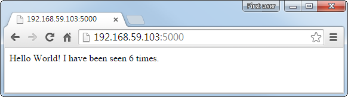

# docker-fig

[Fig](http://www.fig.sh) is an userful orchestration tool for docker in single node,
 yet it can't be installed on boot2docker under Windows Host.

The docker image helps you to run fig to serve the purpose.

## How to use docker-fig

Save the alias setting below in ~/.profile or ~/.bashrc:

    $ alias fig='docker run --rm -it \
        -v $(pwd):/app \
        -v /var/run/docker.sock:/var/run/docker.sock \
        -e FIG_PROJECT_NAME=$(basename $(pwd)) \
        coopermaa/fig'

Run "source ~/.profile" or "source ~/.bashrc" to make it take effect.

For the fig introduction, see [Fig Quickstart](http://www.fig.sh/index.html).

You can clone the [figtest](https://github.com/coopermaa/figtest) repository to have a taste of docker-fig:

    $ git clone https://github.com/coopermaa/figtest
    $ cd figtest
    $ fig up -d

If everything is ok, the web app should now be listening on port 5000.
 So you can browse to http://\<Your host\>:5000 to see it.

